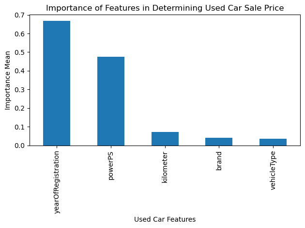

# Used Vehicle Pricing Tool

By Sriram Rao

## What is the right price to pay for a used vehicle?

The biggest dilemma facing a customer in the market for a used automobile is "what is a fair price for this vehicle?". This question is more significant with a used vehicle purchase than a new one as there is no standard MSRP associated with the make, model, and year as with a new auto. 

In addition, used cars sold by private parties bring more uncertainly in pricing and quality into the mix making it a risky transaction. While it we will not address the quality risks, we can certainly take on the pricing problem. 

In this project we will use the historical prices of used vehicles in Europe to device a model that would let a used auto buyer estimate the price they would expect to pay based on the main (yet basic) features of used vehicles.

The source of historical used car price data employed in this project was obtained from: https://www.kaggle.com/datasets/sanskrutipanda/car-pricing-prediction

## The Model

Adopting the CRISP-DM methodology of arriving at a model, we selected the **Random Forest Ensemble Regressor Model** that uses a 'forest' of binary trees to solve the used vehicle pricing problem.

You can refer to the detailed study in this [document](Cars-SriramRao.ipynb).

The model selected 5 features with their relative impact on the used car price shown by the bar graph below. The features chosen in their order of decreasing importance are:

1. Year of Registration (closely related to year of manufacture)
2. The power of the engine
3. Kilometers the vehicle has run (Odometer reading)
4. Brand or make of the car - like Mercedes-Benz, Volvo, Volkswagen  
5. Vehicle type - car, SUV, Limo etc.

## The Pricing Tool

Now we have the ability to estimate the used car price given the 5 features of the vehicle chosen by the customer.

We will publish this pricing tool as a web page www.usedcarprice.com for easy internet wide access by customers.

Once the customer has chosen a used car offered by a private seller they are interested in buying, they will access the web page hosted by us and enter the following details of the car of their interest:

* Year of Registration (Manufacture)
* The power of the engine
* Kilometers the vehicle has run (Odometer reading)
* Brand (Make) of the car - like Volvo, Volkswagen, Mercedes-Benz
* Vehicle type - car, SUV, Limo etc

With the click of a button the estimated price the customer can safely pay will be displayed on the web browser!

## Summary

This project to build a price estimator for used vehicles that the consumer/end user can rely on to help them with the vehicle buying process has been completed. 

Note that the car's model, type of transmission (manual, automatic) or other features than the above mentioned five, did not have significant impact on the pricing. This means the buyer is free to select any of the other features of their choice without having to worry about paying a premium for it.

The tool developed gives the buyer the power to make the car choices without worrying about overpaying!
